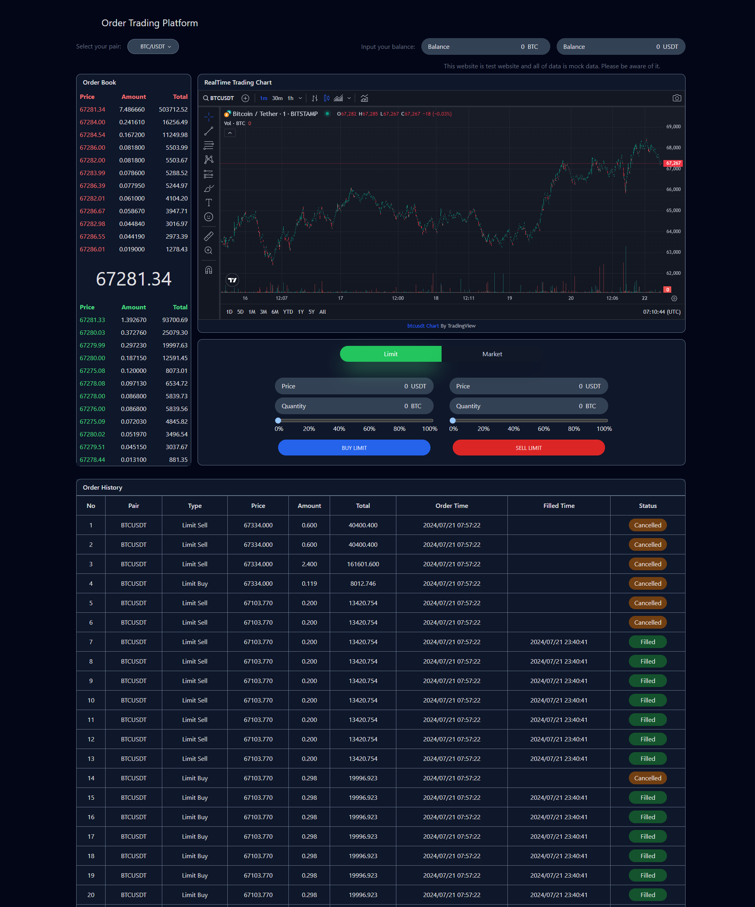

# Order Trading Platform

## Introduction
This project is a hybrid order trading simulator combining CEX (Centralized Exchange) efficiency with DEX (Decentralized Exchange) transparency. Users can simulate buying and selling cryptocurrency pairs with off-chain order matching and on-chain settlement. The system integrates real-time price feeds, a custom order-matching engine, and blockchain wallet connectivity for executing real transactions.

The frontend is built with React, TypeScript, Redux Toolkit, and Tailwind CSS, while the backend is built using Python (FastAPI or Django) for performance and scalability. It uses Binance WebSocket Stream API for live price updates and interacts with blockchain networks for real trade execution.

### Key Features
#### Real-Time Market Data
- Fetches cryptocurrency price data from Binance WebSocket API and updates the UI via WebSocket/SSE.
#### Order Matching Engine (Python Backend)
- Implements CEX-style order book for off-chain trade matching.
- Handles limit and market orders with priority queue and price-time matching algorithm.
- Maintains order depth, trade logs, and balances in MongoDB.
#### Wallet Integration
- Connect Wallet Button on frontend for MetaMask or WalletConnect.
- Handles authentication with Ethereum-compatible wallets.
- Real trades are executed on-chain after matching in backend.

#### Hybrid CEX + DEX Logic
- Fast off-chain order matching for execution speed.
- Final settlement on blockchain through smart contract interaction.
- Transaction hash stored in MongoDB for traceability.

#### Manual Balance Management
- Simulate wallet balances for testing before real trades.
- Users can fund accounts from their connected wallet.

##### Architecture Overview
#### Frontend
- React + TypeScript

- Redux Toolkit (state management)

- Tailwind CSS (responsive UI)

- WebSocket + SSE (real-time data)

- Wallet Integration: MetaMask / WalletConnect using web3.js or ethers.js

#### Backend
- Framework: FastAPI or Django (FastAPI recommended for async WebSockets)

- Order Matching Engine: Custom implementation using priority queues for bid/ask

- Database: MongoDB for order book, trades, balances

- Blockchain Integration: web3.py for Ethereum-compatible networks (e.g., Ethereum, Polygon, BSC)

- Message Queue: RabbitMQ for event-driven updates

- Real-Time Updates: WebSocket or SSE for pushing data to frontend

#### Data Flow
- Market Data: Binance WebSocket → Python Backend → Frontend via WebSocket/SSE.

- Order Submission: User submits order → Python Backend → Matching Engine → MongoDB.

- Trade Execution: When matched, backend triggers on-chain settlement via smart contract.

- Wallet Interaction: Frontend uses MetaMask → signs transaction → confirmed on-chain → backend stores TX hash.

### Requirements
#### Frontend

- React, TypeScript, Redux Toolkit

- Tailwind CSS

- ethers.js or web3.js for wallet integration

#### Backend

- Python 3.11+

- FastAPI (or Django if you prefer full-stack)

- uvicorn for ASGI server

- web3.py for blockchain interaction

- MongoDB (pymongo or motor for async)

- RabbitMQ (aio-pika for async)

- Python-dev (important for compiling dependencies)

#### Blockchain

- Ethereum-compatible testnet (Goerli, Sepolia, Polygon testnet, or BSC testnet)

- Smart contract for settlement (optional but recommended for realism)

- Node.js 22.3.0 (for frontend build)

- MongoDB 7.0

## Tasks to Implement
### Backend

- Setup FastAPI project

- Implement order matching engine with bid/ask priority queue

- Add API endpoints for:

- - Market data

- - Place order (limit/market)

- - Fetch order book

- - Execute matched trade on-chain using web3.py

- Connect MongoDB for storing orders, balances, and TX hashes

- Enable WebSocket for real-time order book updates

### Frontend

- Add Connect Wallet button using ethers.js

- Implement trade form (buy/sell)

- Show live order book and market data

### Blockchain

- Deploy mock smart contract for settlement

- Integrate wallet signature flow